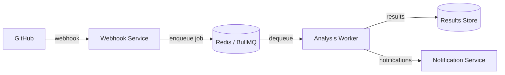

# Security Sentinel

Your company's 24/7 security team that never sleeps. An autonomous security analysis platform for microservices — reliable, compliant, and effective for all levels of developers.

## Architecture Overview



> Services marked **WIP** are under active development.

## Services

| Service | Language | Purpose | Status |
|---------|----------|---------|--------|
| [webhook-service](services/webhook-service/) | Node.js | Ingests GitHub webhooks, enqueues analysis jobs | M1 complete |
| [analysis-worker](services/analysis-worker/) | Node.js | Scan, agentic patching, sandbox validation, PR creation | M2–M5 complete |
| notification-service | — | Delivers findings via Slack, email, etc. | Planned (M6) |

## Getting Started

For local development, bring up Redis + Postgres + the webhook service via Docker Compose:

```bash
cp services/webhook-service/.env.example .env       # source of compose variables
docker compose up -d redis postgres                 # infra
docker compose up --build webhook-service           # webhook service
```

Then run the analysis worker from your host (its Dockerfile lands in M3, see [`docs/production-plan.md`](docs/production-plan.md)):

```bash
cd services/analysis-worker
npm install
cp .env.example .env
npm run migrate
npm start
```

Per-service docs:

- [Webhook Service](services/webhook-service/README.md)
- [Analysis Worker](services/analysis-worker/README.md)

## Architecture Decision Records

Key design decisions are documented in [`docs/decisions/`](docs/decisions/):

| ADR | Title |
|-----|-------|
| [001](docs/decisions/001-bullmq-for-job-queue.md) | Use BullMQ for job queuing |
| [002](docs/decisions/002-return-200-on-failure.md) | Return 200 on processing failure |
| [003](docs/decisions/003-timing-safe-hmac.md) | Timing-safe HMAC comparison |
| [004](docs/decisions/004-claude-agent-sdk-for-brain.md) | Use Claude Agent SDK with markdown subagents for the analysis brain |

## License

TBD
