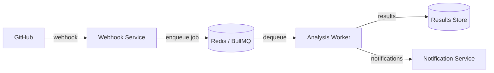

# Security Sentinel

Your company's 24/7 security team that never sleeps. An autonomous security analysis platform for microservices — reliable, compliant, and effective for all levels of developers.

## Architecture Overview

> Services marked **WIP** are under active development.

## Services

| Service | Language | Purpose | Status |
|---------|----------|---------|--------|
| [webhook-service](services/webhook-service/) | Node.js | Ingests GitHub webhooks, enqueues analysis jobs | WIP |
| analysis-worker | — | Consumes jobs and runs security checks | Planned |
| notification-service | — | Delivers findings via Slack, email, etc. | Planned |

## Getting Started

See per-service READMEs for setup instructions:

- [Webhook Service](services/webhook-service/README.md)

## Architecture Decision Records

Key design decisions are documented in [`docs/decisions/`](docs/decisions/):

| ADR | Title |
|-----|-------|
| [001](docs/decisions/001-bullmq-for-job-queue.md) | Use BullMQ for job queuing |
| [002](docs/decisions/002-return-200-on-failure.md) | Return 200 on processing failure |
| [003](docs/decisions/003-timing-safe-hmac.md) | Timing-safe HMAC comparison |

## License

TBD
