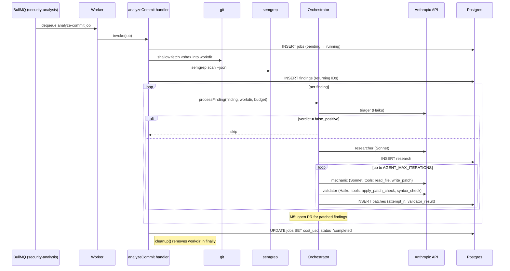

# Analysis Worker

The analysis worker consumes jobs from the `security-analysis` BullMQ queue (enqueued by [`webhook-service`](../webhook-service/)) and runs the Security Sentinel analysis pipeline against the referenced commit.

**Current scope (M1–M5):** consume jobs → checkout → Semgrep → for each finding run the agentic loop (Triager → Researcher → Mechanic ↔ Validator with sandboxed test execution) → on a validated fix, open a GitHub PR. See [`docs/production-plan.md`](../../docs/production-plan.md).

## Prerequisites

| Dependency | Version | Notes                                                              |
|------------|---------|--------------------------------------------------------------------|
| Node.js    | >= 18   |                                                                    |
| Redis      | >= 7    | Shared with `webhook-service`                                      |
| Postgres   | >= 14   |                                                                    |
| `git`      | any     | On PATH; used for shallow checkout                                 |
| `semgrep`  | >= 1.0  | On PATH (`pip install semgrep`); bundled in worker image in M3     |

## Setup

```bash
# 1. Install dependencies
npm install

# 2. Configure environment
cp .env.example .env
# Edit .env with Redis + Postgres connection details

# 3. Run database migrations
npm run migrate

# 4. Start in development mode (auto-reload via nodemon)
npm run dev

# Or start in production mode
npm start
```

## Environment Variables

| Variable             | Description                                | Default              |
|----------------------|--------------------------------------------|----------------------|
| `NODE_ENV`           | Runtime environment                        | `development`        |
| `LOG_LEVEL`          | Winston log level                          | `info`               |
| `WORKER_CONCURRENCY` | Parallel jobs per worker process           | `2`                  |
| `REDIS_HOST`         | Redis hostname                             | `localhost`          |
| `REDIS_PORT`         | Redis port                                 | `6379`               |
| `REDIS_PASSWORD`     | Redis password                             | —                    |
| `PG_HOST`            | Postgres hostname                          | `localhost`          |
| `PG_PORT`            | Postgres port                              | `5432`               |
| `PG_DATABASE`        | Postgres database name                     | `security_sentinel`  |
| `PG_USER`            | Postgres username                          | `sentinel`           |
| `PG_PASSWORD`        | Postgres password                          | —                    |
| `PG_POOL_MAX`        | Max connections in the pool                | `10`                 |
| `GITHUB_TOKEN`       | Optional token for private-repo checkouts  | —                    |
| `WORKDIR_ROOT`       | Root for job-scoped working directories    | `<tmpdir>/sentinel`  |
| `SEMGREP_CONFIG`     | Semgrep rule config (`auto`, `p/...`, etc.)| `auto`               |
| `ANTHROPIC_API_KEY`  | Claude API key (required unless `SKIP_AGENT_LOOP=true`) | —          |
| `CLAUDE_MODEL_TRIAGER`   | Model for triager subagent                  | `claude-haiku-4-5-20251001` |
| `CLAUDE_MODEL_RESEARCHER`| Model for researcher subagent               | `claude-sonnet-4-6`  |
| `CLAUDE_MODEL_MECHANIC`  | Model for mechanic subagent                 | `claude-sonnet-4-6`  |
| `CLAUDE_MODEL_VALIDATOR` | Model for validator subagent                | `claude-haiku-4-5-20251001` |
| `TOKEN_BUDGET_INPUT`  | Hard per-job input-token cap                | `200000`             |
| `TOKEN_BUDGET_OUTPUT` | Hard per-job output-token cap               | `50000`              |
| `AGENT_MAX_ITERATIONS`| Mechanic ↔ Validator reflection-loop cap    | `3`                  |
| `SKIP_AGENT_LOOP`     | Bypass the agentic loop (ack after findings)| `false`              |
| `SANDBOX_IMAGE`       | Docker image for the sandbox (built from `sandbox/Dockerfile`) | `sentinel-sandbox:latest` |
| `SANDBOX_MEMORY_BYTES`| Per-container memory cap                    | `1073741824` (1 GiB) |
| `SANDBOX_CPUS`        | Per-container CPU quota                     | `1`                  |
| `SANDBOX_TIMEOUT_MS`  | Wall-clock cap per sandbox run              | `120000`             |
| `GITHUB_APP_ID`       | GitHub App ID (preferred over PAT)          | —                    |
| `GITHUB_APP_PRIVATE_KEY` | PEM private key (use `\n` for newlines if single-line) | —     |
| `GITHUB_APP_INSTALLATION_ID` | App installation ID per repo / org   | —                    |
| `GITHUB_TOKEN`        | PAT fallback for both checkout and PR push  | —                    |
| `PR_BASE_BRANCH`      | Target branch for PRs                       | `main`               |
| `PR_REVIEWERS`        | Comma-separated GitHub logins to request    | —                    |
| `SKIP_PR_CREATION`    | Run the brain but never open PRs            | `false`              |

## Job Lifecycle



## Data Model

Initial schema lives in [`src/db/migrations/001_init.sql`](src/db/migrations/001_init.sql). Tables: `jobs`, `findings`, `research`, `patches`, `prs`. Only `jobs` is read/written today; the rest are scaffolded so later milestones don't require additional migrations.

## Project Structure

```
services/analysis-worker/
├── src/
│   ├── index.js                # Entry: starts the consumer, wires shutdown
│   ├── consumer.js             # BullMQ Worker factory + lifecycle events
│   ├── handlers/
│   │   └── analyzeCommit.js    # Per-job handler: checkout → scan → agent loop
│   ├── repo/
│   │   ├── checkout.js         # Shallow `git fetch <sha>` into job workdir
│   │   └── commitAndPush.js    # Apply diff → branch → commit → push (token via one-shot URL)
│   ├── scan/
│   │   └── semgrep.js          # Semgrep subprocess wrapper + result normalizer
│   ├── agents/
│   │   ├── sdk.js              # SDK wrapper: tool loop, token budget, cost
│   │   ├── orchestrator.js     # Triage → research → mechanic↔validator loop
│   │   ├── triager.js          # Triager subagent runner
│   │   ├── researcher.js       # Researcher subagent runner
│   │   ├── mechanic.js         # Mechanic subagent runner
│   │   ├── validator.js        # Validator subagent runner (static checks only in M4)
│   │   ├── codeSlice.js        # Numbered code-slice helper for model context
│   │   └── tools/
│   │       ├── index.js        # Tool definitions + handler factory
│   │       ├── paths.js        # safeJoin — prevents workdir escape
│   │       ├── readFile.js     # read_file tool
│   │       └── patchOps.js     # apply_patch_check + syntax_check tools
│   ├── sandbox/
│   │   ├── driver.js           # Dockerode driver: NetworkMode:none, cap-drop, non-root, caps, timeout
│   │   └── runner.js           # runTestsAgainstPatch: scratch copy, apply, detect runner, exec
│   ├── github/
│   │   ├── client.js           # Octokit (App or PAT) + push token minting
│   │   ├── pr.js               # openPullRequest (idempotent: reuses existing on 422)
│   │   ├── template.js         # Title/body/label rendering with prompt-injection hardening
│   │   └── openPrForFinding.js # commit+push+PR+persist
│   ├── queue/
│   │   └── connection.js       # Shared ioredis connection
│   ├── db/
│   │   ├── client.js           # pg Pool + query / withTransaction helpers
│   │   ├── jobs.js             # Job-row persistence (incl. cost_usd setter)
│   │   ├── findings.js         # Bulk-insert + return IDs
│   │   ├── research.js         # Research dossier persistence
│   │   ├── patches.js          # Patch attempt persistence
│   │   ├── prs.js              # PR row persistence + open-PR lookup
│   │   ├── migrate.js          # Forward-only migration runner
│   │   └── migrations/
│   │       └── 001_init.sql
│   └── utils/
│       └── logger.js           # Winston structured logger
├── agents/                     # Subagent system prompts (markdown)
│   ├── triager.md
│   ├── researcher.md
│   ├── mechanic.md
│   └── validator.md
├── logs/                       # Generated log files (gitignored)
├── .env.example
├── package.json
└── README.md                   # ← You are here
```

## Testing

```bash
npm test          # Run Jest test suite with coverage
```

Test fixtures and the E2E pipeline against a known-vulnerable repo land alongside M5 (PR creation). See [`docs/production-plan.md`](../../docs/production-plan.md#testing-strategy).

## Agentic Brain (M4)

Four subagent roles, defined as markdown system prompts in [`agents/`](agents/):

| Subagent | Model tier | Tools | Role |
|----------|-----------|-------|------|
| Triager | Haiku | — | Real risk vs. false positive |
| Researcher | Sonnet | — | Remediation dossier (training knowledge only — web tools deferred) |
| Mechanic | Sonnet | `read_file`, `write_patch` | Produces unified diff |
| Validator | Haiku | `apply_patch_check`, `syntax_check`, `run_tests` | Patch applies + parses + (when detectable) passes tests inside the sandbox |

**Reflection loop:** if the Validator rejects a patch, the failure details feed back into the Mechanic's next attempt. Capped at `AGENT_MAX_ITERATIONS` (default 3).

**Budget enforcement:** input + output tokens accumulate across all subagent calls for a single job. When either limit is exceeded, the job fails with `budget exceeded`. Per-job USD cost (estimated from token usage and per-model pricing in `sdk.js`) is persisted to `jobs.cost_usd`.

**Cost controls in `sdk.js`:** system prompts are sent with `cache_control: ephemeral` so repeated invocations within the 5-minute prompt-cache window cost much less.

**Tool safety:** all tool handlers are bound to the job's working directory; `safeJoin()` rejects any path that resolves outside it (no `../` traversal, no absolute paths). The `read_file` tool caps reads at 256 KB; the `syntax_check` tool copies the workdir to a scratch dir before applying the patch so the original checkout is never mutated.

## Sandbox (M3)

Patched code executes in a fresh Docker container per `run_tests` invocation:

- `NetworkMode: none` — no outbound network at all.
- `CapDrop: ['ALL']` + `SecurityOpt: ['no-new-privileges']`.
- Runs as the non-root `sandbox` user defined in [`sandbox/Dockerfile`](sandbox/Dockerfile).
- Memory, CPU, PID, and wall-clock caps (see env vars).
- Workdir is bind-mounted from a host-side scratch copy — the original analysis workdir is never exposed.
- One-shot: the container is removed in `finally` regardless of exit.

Build the image once before running the worker: `docker build -t sentinel-sandbox:latest -f sandbox/Dockerfile .`

## GitHub PR creation (M5)

After the orchestrator returns `status: patched`, the handler calls `openPrForFinding`:

1. Lookup `prs` table — if an open PR for this finding already exists, skip (idempotency).
2. Apply the diff in the analysis workdir on a fresh `sentinel/<short-sha>/<finding-id>` branch.
3. Commit with a structured message and force-push the branch via a one-shot authenticated URL (token is never persisted in `git config`).
4. Open the PR via Octokit with a fully-templated title (no LLM free text), a body that wraps any agent-generated text inside fenced code blocks with backticks neutralized, and labels from `{security-sentinel, sev-{high,medium,low}}`.
5. Persist the PR row.

Auth supports both GitHub Apps (preferred — least-privilege, per-install scoping, 1h token rotation) and PATs (dev fallback). `SKIP_PR_CREATION=true` runs the full brain but doesn't push.
