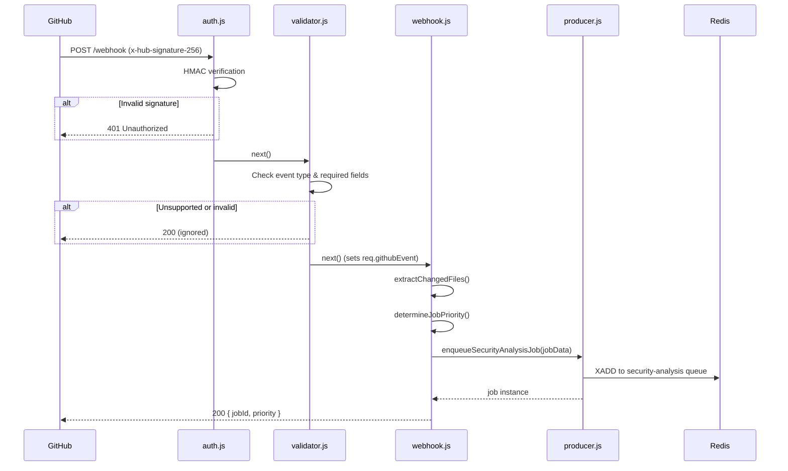

# Webhook Service

The webhook service is the ingestion layer of Security Sentinel. It receives GitHub webhook events (push and pull request), authenticates requests via HMAC signature verification, validates payloads, and enqueues security analysis jobs into a BullMQ queue backed by Redis.

## Prerequisites

| Dependency | Version |
|------------|---------|
| Node.js    | >= 18   |
| Redis      | >= 7    |

## Setup

```bash
# 1. Install dependencies
npm install

# 2. Configure environment
cp .env.example .env
# Edit .env with your GitHub webhook secret, Redis credentials, etc.

# 3. Start in development mode (auto-reload via nodemon)
npm run dev

# Or start in production mode
npm start
```

## Environment Variables

| Variable                | Description                                                | Default       |
|-------------------------|------------------------------------------------------------|---------------|
| `PORT`                  | HTTP server port                                           | `3000`        |
| `NODE_ENV`              | Runtime environment                                        | `development` |
| `GITHUB_WEBHOOK_SECRET` | Shared secret for HMAC verification                        | —             |
| `REDIS_HOST`            | Redis server hostname                                      | `localhost`   |
| `REDIS_PORT`            | Redis server port                                          | `6379`        |
| `REDIS_PASSWORD`        | Redis authentication password                              | —             |
| `RATE_LIMIT_WINDOW_MS`  | Sliding window for `/webhook` rate limiting (ms)           | `60000`       |
| `RATE_LIMIT_MAX`        | Max requests per IP per window on `/webhook`               | `60`          |
| `REPLAY_TTL_SECONDS`    | TTL for `X-GitHub-Delivery` replay-dedup keys              | `86400`       |
| `LOG_LEVEL`             | Winston log level                                          | `info`        |

## API Endpoints

### `POST /webhook`

Receives a GitHub webhook event. The request passes through:

1. **Correlation ID** — read `x-request-id` / `x-github-delivery` or generate a UUID; echoed back as `x-request-id`
2. **Rate limit** — `RATE_LIMIT_MAX` per IP per `RATE_LIMIT_WINDOW_MS`
3. **Replay protection** — Redis `SET NX EX` on `X-GitHub-Delivery`; redeliveries within `REPLAY_TTL_SECONDS` return 200 without re-enqueuing
4. **HMAC authentication** — verifies `x-hub-signature-256` against the raw request body
5. **Payload validation** — ensures required fields exist for the event type
6. **Job enqueue** — extracts metadata and pushes to the `security-analysis` BullMQ queue with the correlation ID

**Success response:**

```json
{
  "message": "Webhook received and job enqueued",
  "jobId": "owner/repo-abc1234",
  "priority": 2,
  "correlationId": "8400e3b2-..."
}
```

### `GET /healthz`

Liveness probe. Always returns 200 if the process is up.

```json
{ "status": "ok", "uptime": 1234.56 }
```

### `GET /readyz`

Readiness probe. Pings Redis; returns 503 if unreachable so a load balancer can drain the instance.

```json
{
  "status": "ready",
  "redis": "ok",
  "queue": { "waiting": 3, "active": 1, "completed": 50, "failed": 2 }
}
```

### `GET /webhook/health` (legacy)

Kept for backwards compatibility; prefer `/readyz`.

## Request Lifecycle



## Project Structure

```
services/webhook-service/
├── src/
│   ├── index.js                    # Express app: middleware, routes, graceful shutdown
│   ├── routes/
│   │   ├── webhook.js              # POST /webhook → enqueue
│   │   └── health.js               # /healthz + /readyz
│   ├── middleware/
│   │   ├── auth.js                 # HMAC signature verification (uses req.rawBody)
│   │   ├── validator.js            # Payload validation & event filtering
│   │   ├── correlationId.js        # Per-request correlation ID
│   │   └── replayProtection.js     # X-GitHub-Delivery dedup via Redis
│   ├── queue/
│   │   └── producer.js             # BullMQ job producer + queue metrics
│   ├── redis/
│   │   └── client.js               # General-purpose Redis client (separate from BullMQ)
│   └── utils/
│       └── logger.js               # Winston structured logger
├── tests/                          # Jest unit tests for middleware
├── Dockerfile                      # Multi-stage build, non-root runtime
├── .dockerignore
├── .env.example
├── package.json
└── README.md                       # ← You are here
```

## Correlation IDs

Every request gets a correlation ID, written to:
- `x-request-id` response header,
- every log line for the request,
- the enqueued job's `correlationId` field — so the analysis worker logs share the same ID.

To trace a single webhook through the system, grep both services' logs for the ID returned in the response.

## Testing

```bash
npm test          # Run Jest test suite with coverage
```
