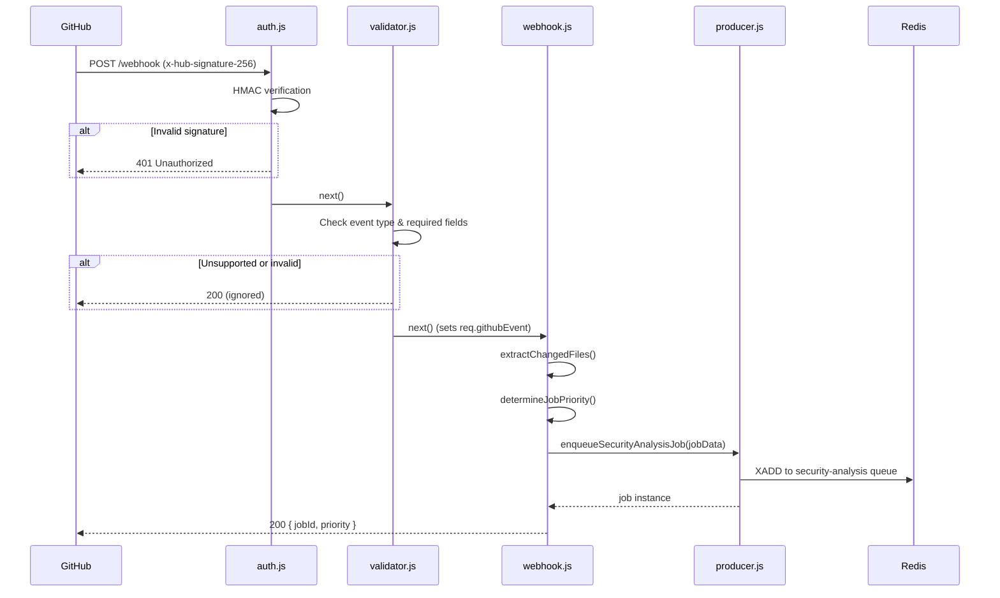

# Webhook Service

The webhook service is the ingestion layer of Security Sentinel. It receives GitHub webhook events (push and pull request), authenticates requests via HMAC signature verification, validates payloads, and enqueues security analysis jobs into a BullMQ queue backed by Redis.

## Prerequisites

| Dependency | Version |
|------------|---------|
| Node.js    | >= 18   |
| Redis      | >= 7    |

## Setup

```bash
# 1. Install dependencies
npm install

# 2. Configure environment
cp .env.example .env
# Edit .env with your GitHub webhook secret, Redis credentials, etc.

# 3. Start in development mode (auto-reload via nodemon)
npm run dev

# Or start in production mode
npm start
```

## Environment Variables

| Variable               | Description                           | Default       |
|------------------------|---------------------------------------|---------------|
| `PORT`                 | HTTP server port                      | `3000`        |
| `NODE_ENV`             | Runtime environment                   | `development` |
| `GITHUB_WEBHOOK_SECRET`| Shared secret for HMAC verification  | —             |
| `REDIS_HOST`           | Redis server hostname                 | `localhost`   |
| `REDIS_PORT`           | Redis server port                     | `6379`        |
| `REDIS_PASSWORD`       | Redis authentication password         | —             |
| `LOG_LEVEL`            | Winston log level                     | `info`        |

## API Endpoints

### `POST /webhook`

Receives a GitHub webhook event. The request passes through:

1. **HMAC authentication** — verifies `x-hub-signature-256`
2. **Payload validation** — ensures required fields exist for the event type
3. **Job enqueue** — extracts metadata and pushes to the `security-analysis` BullMQ queue

**Success response:**

```json
{
  "message": "Webhook received and job enqueued",
  "jobId": "owner/repo-abc1234",
  "priority": 2
}
```

### `GET /webhook/health`

Returns service health and queue metrics.

```json
{
  "status": "healthy",
  "service": "Webhook Service",
  "uptime": 1234.56,
  "queue": { "waiting": 3, "active": 1, "completed": 50, "failed": 2 }
}
```

## Request Lifecycle



## Project Structure

```
services/webhook-service/
├── src/
│   ├── index.js              # Express app entry point (WIP)
│   ├── routes/
│   │   └── webhook.js        # Route handler — wires middleware + producer
│   ├── middleware/
│   │   ├── auth.js           # HMAC signature verification
│   │   └── validator.js      # Payload validation & event filtering
│   ├── queue/
│   │   └── producer.js       # BullMQ job producer + queue metrics
│   └── utils/
│       └── logger.js         # Winston structured logger
├── logs/                     # Generated log files (gitignored)
├── .env.example              # Environment variable template
├── package.json
└── README.md                 # ← You are here
```

## Testing

```bash
npm test          # Run Jest test suite with coverage
```
